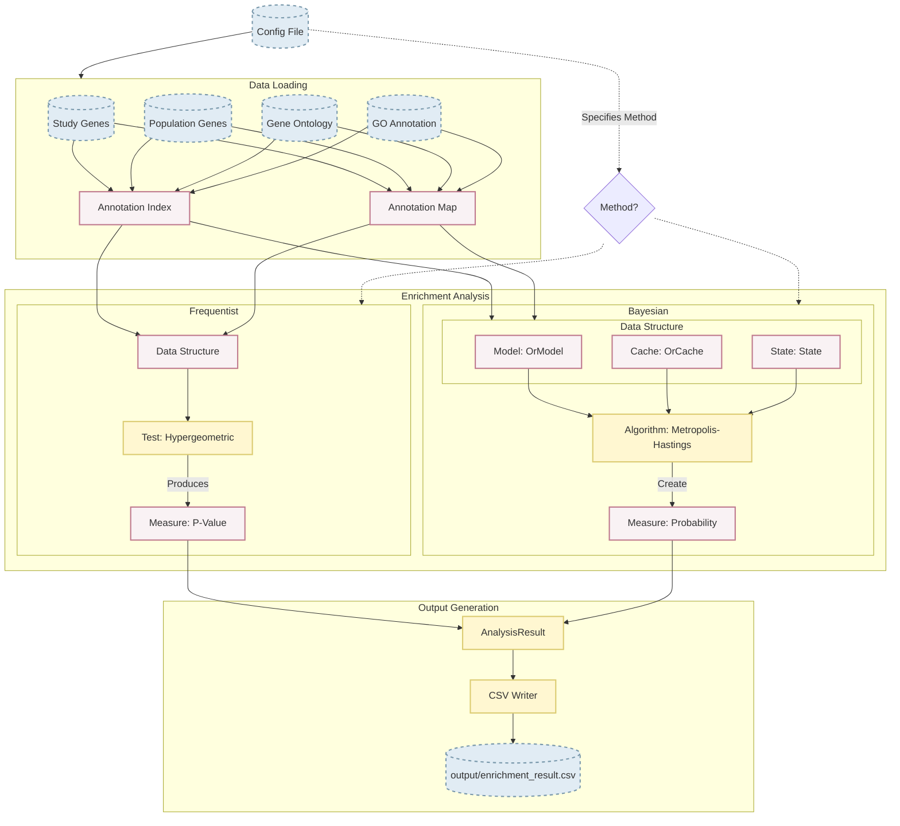

# Ontologizer

Fast and safe implementation of the Ontologizer — a tool for Gene Ontology (GO) enrichment analysis using Frequentist (
hypergeometric test) and Bayesian (inference) methods.

## Gene Symbols

Gene symbols in the study and population gene sets must match the gene symbols in the `.gaf` annotation file —
specifically column 2 (`DB_Object_Symbol`).

## Project Layout

```
ontologizer/
├── examples/                    # Example inputs (tracked in git)
│   ├── yeast/
│   │   ├── study_genes.txt      # 493 yeast study genes
│   │   ├── population_genes.txt # 6010 yeast background genes
│   │   └── config.json          # Bayesian analysis config
│   └── go0090717/
│       ├── study_genes.txt      # Study genes for GO:0090717
│       ├── population_genes.txt # Background genes
│       └── config.json          # Frequentist analysis config
│
├── data/                        # Downloaded at runtime (gitignored)
│   ├── go-basic.json            # Auto-downloaded from GO
│   └── goa_yeast.gaf            # Provide your own annotation file
│
└── output/                      # Analysis results (gitignored)
    └── enrichment_result.csv
```

## Quick Start

### 1. Provide a GO annotation file

Download a `.gaf` file for your organism from
the [GO Annotation Database](https://current.geneontology.org/products/pages/downloads.html) and place it in `data/`.
For example:

- Yeast: `data/goa_yeast.gaf`
- Human: `data/goa_human.gaf`

The GO ontology (`data/go-basic.json`) is downloaded automatically on first run.

### 2. Run an example

Run the yeast Bayesian example (uses `config.json` in the project root by default):

```bash
cargo run --release --features cli
```

Or point to a specific example config:

```bash
cargo run --release --features cli -- examples/yeast/config.json
cargo run --release --features cli -- examples/go0090717/config.json
```

Results are written to `output/enrichment_result.csv`.

### 3. Build the binary

```bash
cargo build --release --features cli
./target/release/ontologizer examples/yeast/config.json
```

## Configuration

Each example ships with a ready-to-use `config.json`. The schema is:

```json
{
  "study_genes_path": "examples/yeast/study_genes.txt",
  "population_genes_path": "examples/yeast/population_genes.txt",
  "go_path": "data/go-basic.json",
  "goa_path": "data/goa_yeast.gaf",
  "method": {
    "method": "bayesian"
  }
}
```

For frequentist analysis:

```json
{
  "method": {
    "method": "frequentist",
    "topology": "standard",
    "correction": "bonferroni"
  }
}
```

**Topology options:** `standard`, `parentUnion`, `parentIntersection`

**Correction options:** `bonferroni`, `bonferroniHolm`, `benjaminiHochberg`, `none`

## Documentation

```bash
cargo doc --document-private-items --open
```

## Architecture

