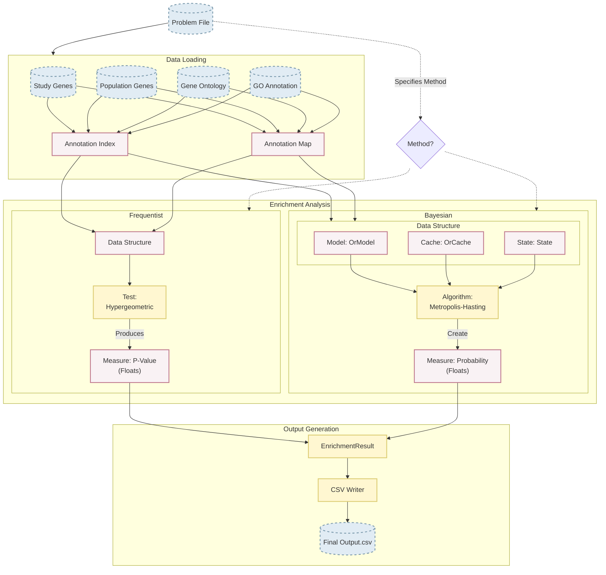

# ontologizer
Fast and safe implementation of the Ontologizer 


To run the example program, enter
```bash
 cargo run --bin onto --features="cli" 
```
For faster performance, enter
```bash
cargo run --release --bin onto --features="cli"
```


## To build the binary demo (with clap)
```bash
cargo build --release --features cli
```
(the binary is then in ``./target/release/rpt``)
to run it
```bash
cargo run --features cli --bin rpt
```
## To see private features in documentation
```bash
cargo doc --document-private-items --open
```
## Structure

