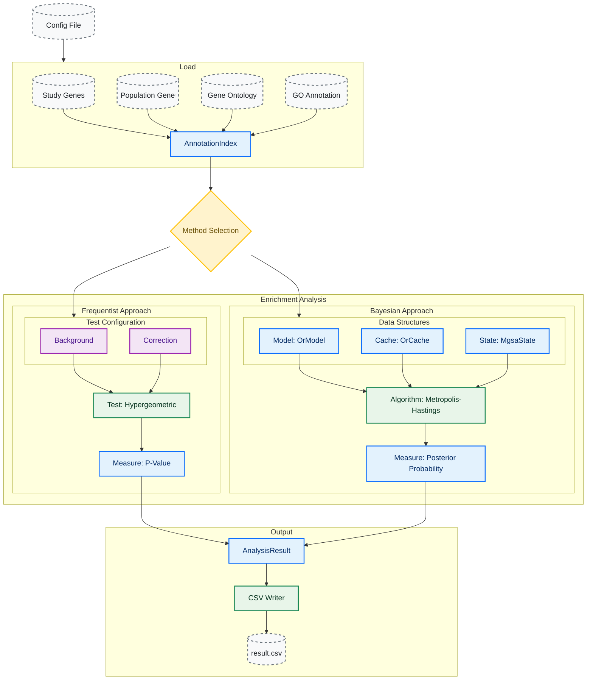

# Ontologizer

Fast and safe implementation of the Ontologizer — a tool for Gene Ontology (GO) enrichment analysis using Frequentist (
hypergeometric test) and Bayesian (inference) methods.

## Gene Symbols

Gene symbols in the study and population gene sets must match the gene symbols in the `.gaf` annotation file —
specifically column 2 (`DB_Object_Symbol`).

## Try it

The `examples/` folder ships ready-to-run study/population gene sets for **human** and **yeast**, with two configs per
organism — one Frequentist, one Bayesian. The only file you need to provide yourself is the organism-specific GO
annotation (`.gaf`); the GO ontology JSON is fetched automatically on first run.

> **Heads up:** gene symbols in study/pop files must match column 2 (`DB_Object_Symbol`) of the GAF. Organism mismatch
> is the most common first-run failure.

### 1. Build

```bash
cargo build --release
```

### 2. Download the GAF for your organism

Place the unzipped file in `data/` with the filename the configs expect:

**Human** (`data/goa_human.gaf`):

```bash
mkdir -p data
wget https://current.geneontology.org/annotations/goa_human.gaf.gz
gunzip goa_human.gaf.gz
mv goa_human.gaf data/
```

**Yeast** (`data/goa_yeast.gaf` — the SGD-curated yeast GAF, renamed to match the config):

```bash
mkdir -p data
wget https://current.geneontology.org/annotations/sgd.gaf.gz
gunzip sgd.gaf.gz
mv sgd.gaf data/goa_yeast.gaf
```

### 3. Run

Pick one (or several) of the four configs:

```bash
cargo run --release -- examples/human/config_frequentist.json
cargo run --release -- examples/human/config_bayesian.json
cargo run --release -- examples/yeast/config_frequentist.json
cargo run --release -- examples/yeast/config_bayesian.json
```

Each invocation writes its results next to the inputs, e.g.
`examples/human/results_human_frequentist.csv`,
`examples/yeast/results_yeast_bayesian.csv`.

Running with no argument falls back to the project-root `config.json` (yeast Frequentist):

```bash
cargo run --release
```

### 4. Sanity-check (optional)

Each example folder includes a `solution_{org}.tsv` file mapping known-enriched GO terms to their gene members. It is a
ground-truth reference, not a results CSV — useful for spot-checking that top hits in your output overlap with these
terms.

## Configuration

Each example comes with a ready-to-use `config.json`. The schema is:

```json
{
  "study_file": "examples/ORGANISM/NAME_study_genes.txt",
  "pop_file": "examples/ORGANISM/NAME_pop_genes.txt",
  "go_file": "data/go-basic.json",
  "goa_file": "data/goa_yeast.gaf",
  "out_file": "path/to/output.csv",
  "method": {
    "method": "Bayesian"
  }
}
```

**Method otions:** `Bayesian`, `Frequentist`.

For frequentist analysis two further parameters must be passed

```json
{
  "method": {
    "method": "Frequentist",
    "background": "Standard",
    "correction": "Bonferroni"
  }
}
```

**Background options:** `Standard`, `ParentUnion`, `ParentIntersection`

**Correction options:** `Bonferroni`, `BonferroniHolm`, `BenjaminiHochberg`, `None`

## Architecture

